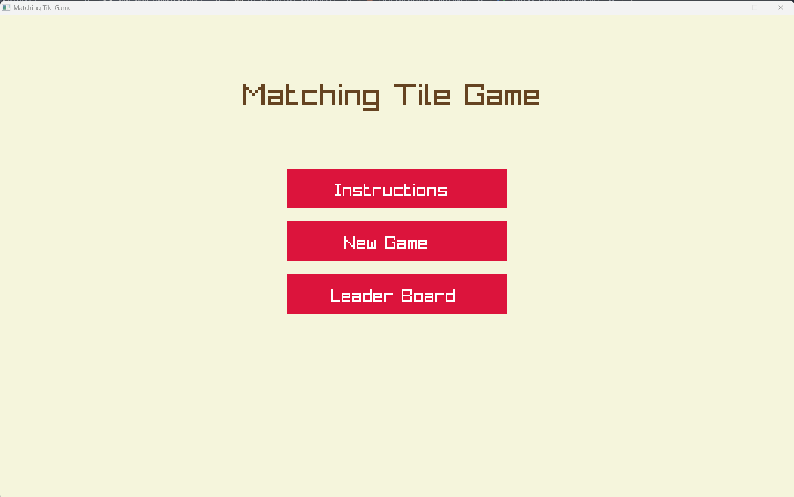
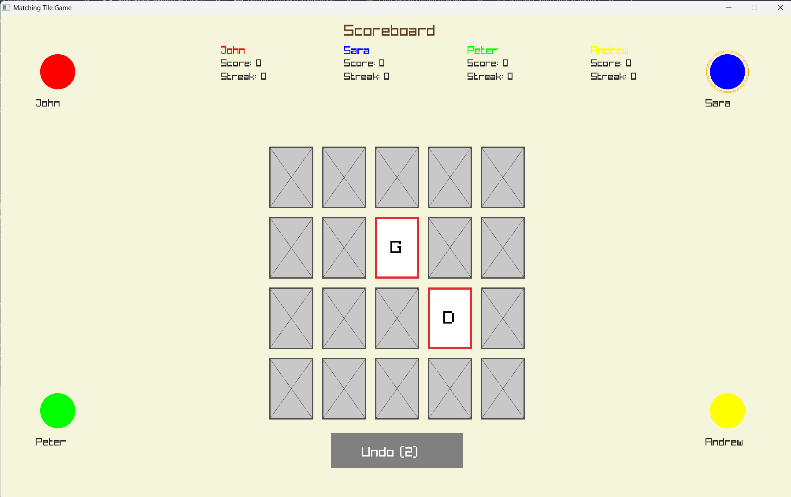
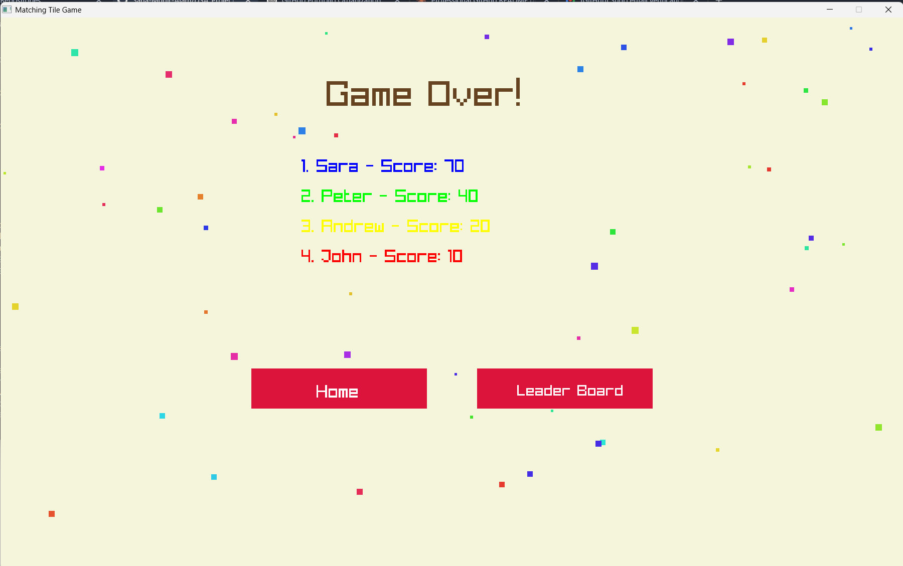
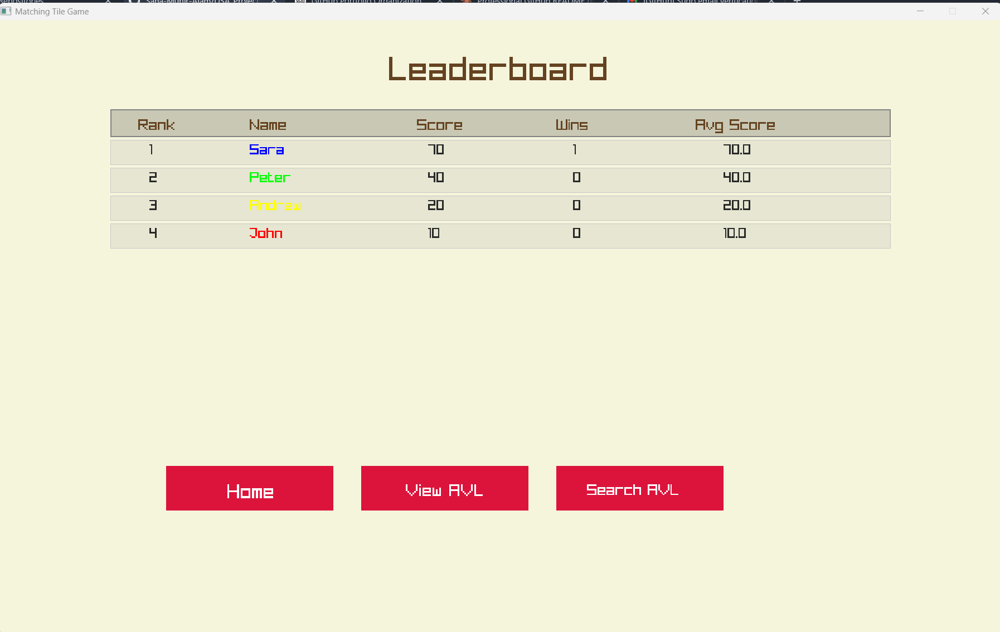
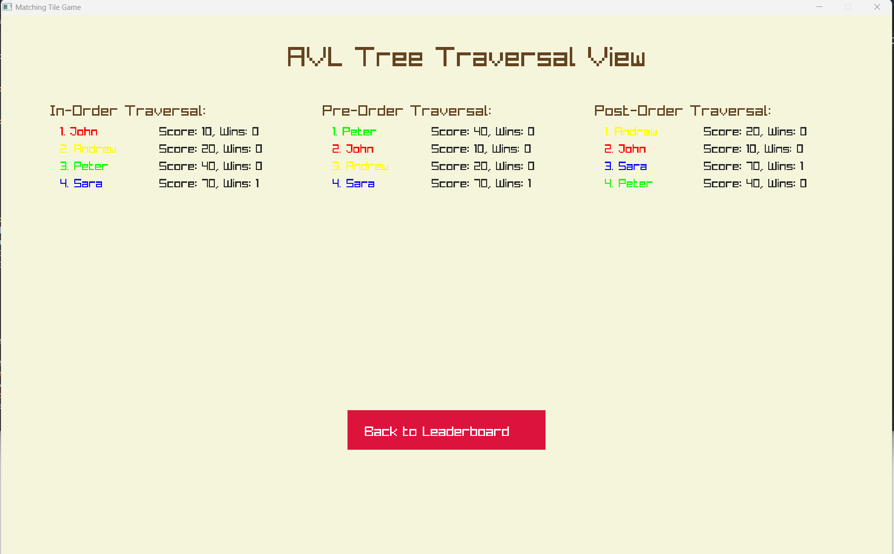

# Matching Tile Game

## Overview

A graphical, multiplayer memory card-matching game built in C++ using the Raylib library. The game is a **Data Structures and Algorithms (DSA) course project** designed to demonstrate applied usage of doubly linked lists, custom template-based stacks and queues, AVL trees, and merge sort — all implemented from scratch without STL data structure wrappers. Players take turns flipping tiles on a 4×5 grid, attempting to match pairs, with full score tracking, streak bonuses, undo functionality, a persistent leaderboard, and an AVL tree visualization interface.

## Features

- **Doubly Linked List Card System:** All 20 cards are stored in a doubly linked list; matched cards are removed from the list dynamically
- **2–4 Player Support:** Players enter custom names and are assigned unique colors; turns cycle through a custom template queue
- **Streak Bonus System:** Consecutive matches award bonus points; streaks are tracked per player using a custom template stack
- **Undo Functionality:** Each player has 2 undo chances per turn (only for the first card selected); disabled when ≤10 cards remain
- **Game Over Screen with Confetti:** Particle-based confetti animation plays on game completion
- **Continue Game Mode:** Players can resume the last game session with the same player lineup
- **Persistent Leaderboard:** Player records are saved to file and loaded across sessions; leaderboard tracks score, wins, games played, and average score
- **AVL Tree Leaderboard:** All player records are stored in an AVL tree (self-balancing BST); supports in-order, pre-order, and post-order traversal views
- **AVL Score Search:** Players can search the leaderboard by score to find matching records
- **Merge Sort Leaderboard Display:** The leaderboard screen uses merge sort to rank players
- **Duplicate Player Detection:** Warns the user if a player name already exists in history and offers to continue or rename

## Tech Stack

**Language:** C++

**Graphics Library:** Raylib (r5.x)

**Data Structures (all custom-implemented):**
- Doubly Linked List (`CardList`, `CardNode`)
- Template Stack (`CustomStack<T>`) — used for undo and streak tracking
- Template Queue (`CustomQueue<T>`) — used for player turn management
- AVL Tree (`AVLTree`) — used for leaderboard storage and traversal

**Algorithms:**
- Merge Sort (leaderboard ranking)
- AVL Rotations (insert, balance)
- Binary Search (AVL score search)

**File I/O:** Text-based persistence for player history

## System Design / Working

**Card System:**

Cards are stored as a doubly linked list of `CardNode` objects. Each node holds a `char value`, `bool flipped`, `bool matched`, and a `guiIndex` for mapping to the visual grid. The game initializes 10 unique character pairs (A–J), shuffles them randomly, and inserts them into the list. The GUI renders a static 4×5 grid, but only draws cards whose list node has not been marked as matched. When a match is confirmed, both nodes are permanently removed from the list.

**Player Turn Queue:**

Players are managed using a `CustomQueue<Player*>`. On each turn, the front player is dequeued, takes their turn, and re-enqueued. When a player mismatches, control passes to the next player immediately.

**Undo Stack:**

Each player has an undo left count. When a player selects their first card and has undos remaining (and total cards > 10), they can undo. The card index of the first selection is tracked and reversed, restoring the board state.

**Leaderboard (AVL Tree + Merge Sort):**

All players are stored in an `AVLTree` keyed by score. The tree maintains self-balance through left/right rotations on insert. The leaderboard screen calls merge sort on the AVL in-order traversal to produce a ranked display. The AVL screen shows all three traversal orders side-by-side. Score search runs a standard BST search by score value.

**Persistence:**

On game over (currently commented out in code), player data is saved to a file. On launch, existing player records are loaded, allowing continued games and cumulative leaderboard history.

**Screen State Machine:**

```
TITLE_SCREEN
├── Instructions
├── New Game → SELECT_PLAYERS → NAME_ENTRY → GAME_PLAY → GAME_OVER
│                                               └── LEADERBOARD → AVL_VIEW / AVL_SEARCH
└── Continue Game → GAME_PLAY (reuses last players)
```

## Screenshots

- "Title screen with New Game, Continue, and Leaderboard options"

- "4×5 card grid during active gameplay with per-player scoreboards"

- "Game over screen with confetti animation and ranked results"

- "Leaderboard table with merge-sorted player rankings"

- "AVL tree traversal view — in-order, pre-order, and post-order displayed side-by-side"


## How to Run Locally

```bash
# Prerequisites: Install Raylib (https://www.raylib.com/)

# Clone the repository
git clone <repo-url>
cd DSA_Project/Matching_Tiles_Final

# Compile (Windows with Raylib installed)
g++ -std=c++17 main.cpp GameLogic.cpp -o game.exe -lraylib -lopengl32 -lgdi32 -lwinmm

# Run
./game
```

## Folder Structure

```
DSA_Project/
└── Matching_Tiles_Final/
    ├── main.cpp        # Raylib rendering, screen states, UI logic
    ├── GameLogic.h     # All data structure declarations (CardList, AVLTree, Player, GameManager)
    └── GameLogic.cpp   # Full implementations of all data structures and game logic
```
---
Enjoy the game. Good Luck!!
